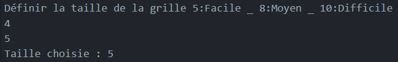

# L'éditeur de grille

## Le mode d'emploi

Lancer le fichier GridEditor.rb
Sélectionner dans le terminal une valeur entre 5 , 8 et 10 pour le niveau de difficulté.

Editer la grille à l'aide de clicks
En cliquant sur la "CROIX" de fermeture de la fenêtre la grille est enregistrée dans un dossier saves/ (différent du dossier saves/ dans projet final)
La fenêtre ne se fermera pas car le terminal attendra une valeur pour la grille, 0 pour la grille1 ; 1 pour la grille2; etc...
Une fois la valeur entrée la sauvegarde est effectuée et le programme se termine.

ENJOY !
