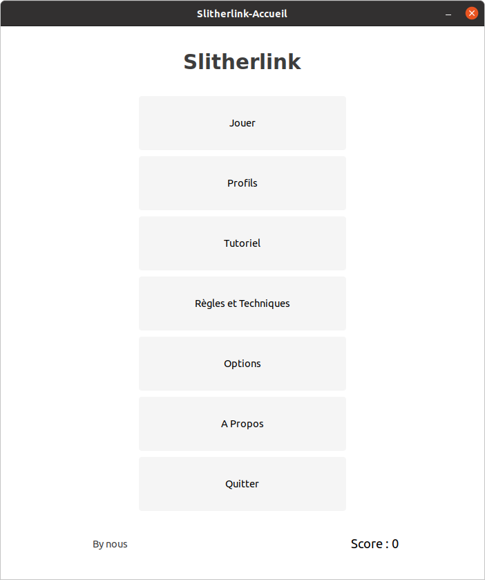

# Bienvenue !

Voici le README permettant de comprendre ce qu'est ce projet. Ce projet se décompose en plusieurs parties, un readme par dossier, un fichier shell pour exécuter correctement le programme . Pour rappel l'objectif de ce projet est de réaliser, en groupe de 9, un jeu type puzzle nommé Slitherlink. Nous sommes 9 étudiants de L3 Informatique à Le Mans Université et devons dans le cadre du module Génie Logiciel 2, réaliser ce dit jeu.

## Les développeurs
Une équipe unique composé de 9 étudiants issus de la l3 Informatique de Le Mans Université durant l'année 2021-2022.
-   Charles Renoit
-   Rodrigue Meunier
-   Mathis Morisseau
-   Julien Mahouin
-   Julien Ratouit
-   Lucas Renard
-   Nicolas Tachet
-   Guillaume Vallet
-   Yohann Delacroix

## Fichiers

L'ensemble des fichiers sources sont disponibles dans le fichier src à la racine du projet.
Ils sont répartis dans des dossiers portant un nom explicites.
Par exemple, les fichiers sources en rapport avec une partie seront dans le dossier [Partie](src/Partie/).

# Les paquets nécessaires
Pour pouvoir exécuter le jeu, vous devez avoir les paquets nécessaire, c'est-à-dire avoir Ruby d'installer ainsi que gtk3. Pour ce faire, vous trouverez un fichier nommé installer.sh qui se trouve à la racine du projet. Une fois ce script bash exécuté, il se chargera d'installer l'ensemble des paquets dit précédement.

# Lancer le jeu
Après avoir installé les paquets requis pour le jeu, si aucune erreur n'a été engrangé, vous allez maintenant pouvoir lancer le jeu !
Pour ce faire placez-vous dans le dossier src et exécutez la commande:

    ruby ./main.rb
Miracle, le jeu se lance !

# Divers

-   Ruby
-   Gtk3 Ruby
-   Documentation rdoc
-   Glade Gtk3
-   Un editeur de grille !

# Licence
Certains fichiers (surtout des images) sont sous licence donc nous vous prions de ne pas publier cette archive n'importe où.
L'équipe du groupe 6 de la l3 Informatique du Mans vous remercie d'avoir lu ce Readme.
