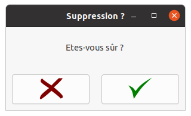

# Le dossier Popup
Le dossier popup contient 3 classes permettant de générer une popup. L'objectif de ces classes est de pouvoir rendre la génération de popup très facile sans se préoccuper des fenêtres etc.

## PopupBase.rb
La PopupBase est une classe abstraite qui permet de gérer la fenêtre de la popup. Les sous-classes de popup géreront des composants supplémentaires selon leurs spécifications.

## PopupText.rb
La classe PopupText est une sous-classe de PopupBase, elle permet de faire l'affichage d'une popup avec un texte unique écrit dedans.

## PopupVerification.save
Certainement la popup la plus "complexe" des 3 popups. En effet, cette popup agit comme une interface java car elle nécessite que l'appelant de la popup ait défini 2 méthodes. Ces 2 méthodes sont valider() et refuser(). Ces méthodes sont appelées selon ce que l'utilisateur sélectionne.

